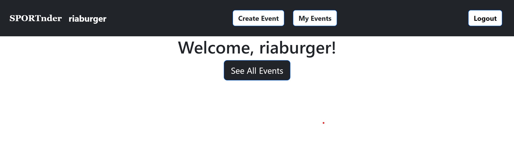
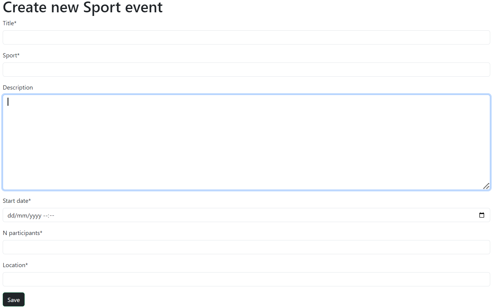
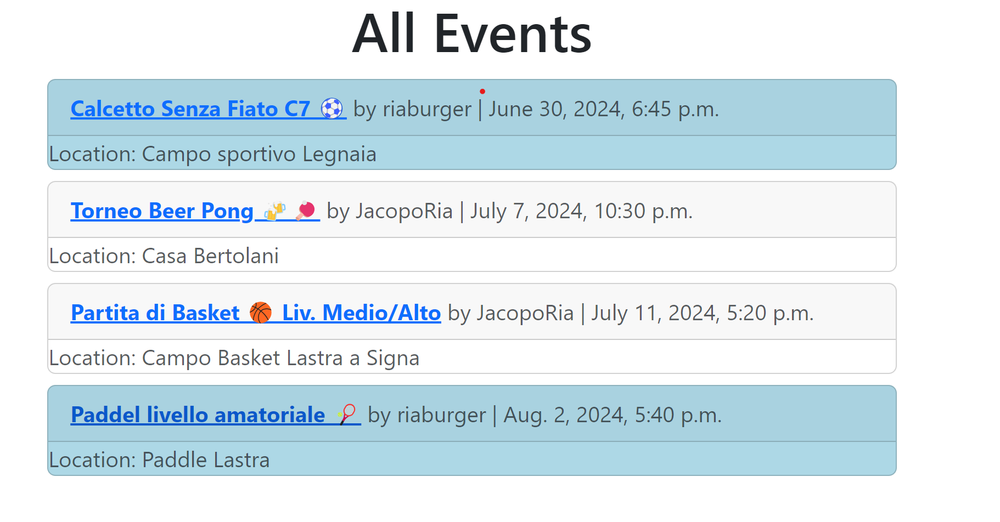
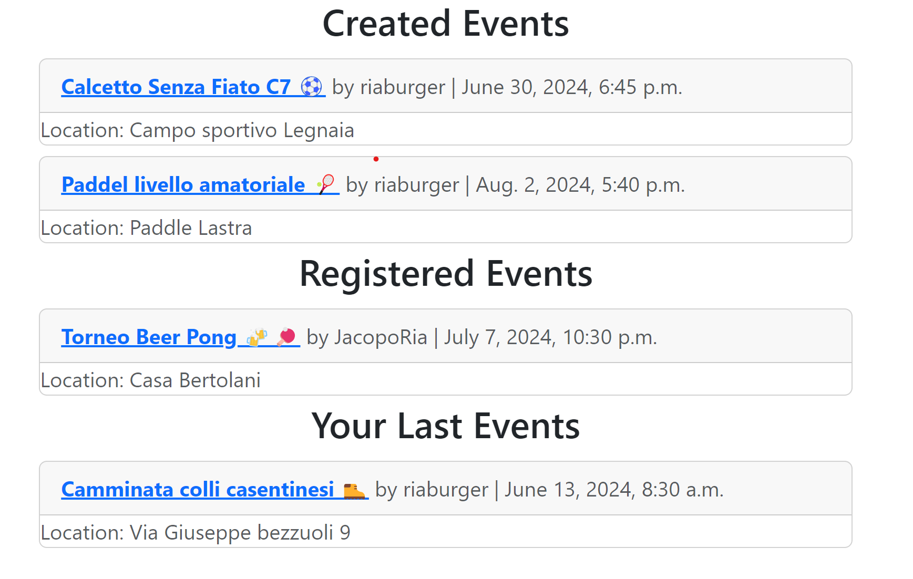
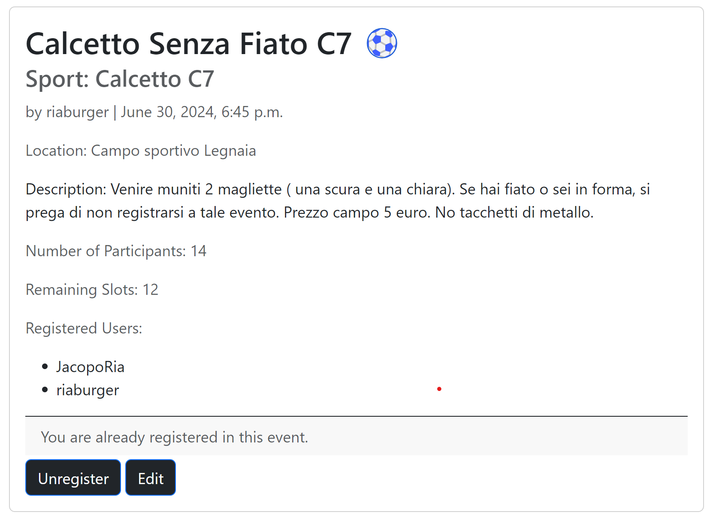
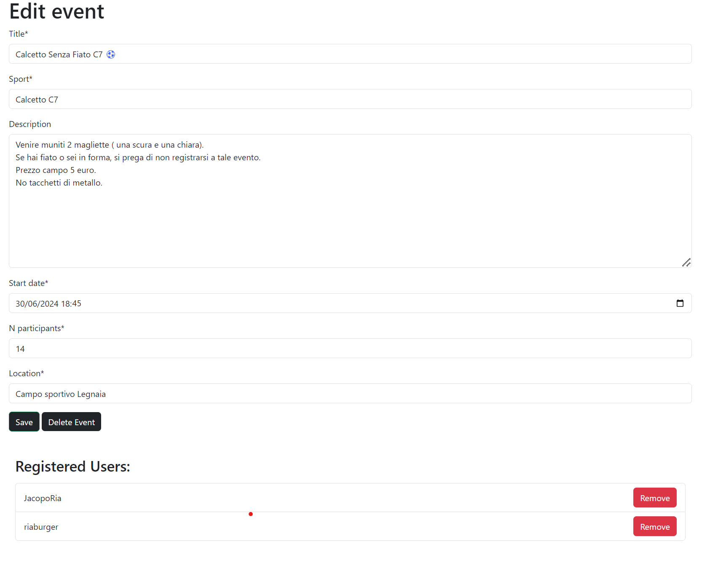

# SPORTnder

Applicazione web back-end, sviluppata utilizzando _Python_ e il framework _Django_, consente a tutti gli utenti registrati di creare, gestire e partecipare a eventi sportivi. 

Nella HomePage è presente un messaggio di benvenuto per l'utente se loggato e un pulsante chiamato _See all events_ che permette di visualizzare tutti gli eventi presenti nel database che hanno la data di inizio maggiore o uguale alla data corrente.

Il pulsante per tornare alla HomePage è il nome del sito _SPORTnder_ presente nella navbar.

All'utente loggato comparira' nella navbar: 
- un pulsante _My events_ che permette di visualizzare tutti gli eventi creati dall'utente o a cui ha partecipato;
- un pulsante _Create event_ che permette di creare un nuovo evento;
- un pulsante _Logout_ che permette di effettuare il logout. \

# MODALITA' DI UTILIZZO

__Creazione di un evento:__
Per creare un evento l'utente deve cliccare sul pulsante _Create event_ presente nella navbar, compilare il form con i dati richiesti e cliccare sul pulsante _Create_ per salvare l'evento nel database e renderlo visibile nella lista degli eventi per tutti gli utenti.

__Visualizzazione degli eventi:__
Per visualizzare tutti gli eventi presenti nel database che non sono gia' passati oppure che hanno un numero di partecipanti iscritti minore del numero di partecipanti richiesti per l'evento. \
L'utente devra cliccare sul pulsante _See all events_ presente nella HomePage per la visualzzazione degli eventi.
Gli eventi compariranno in delle card, ognuna delle quali contiene le informazioni relative all'evento: nome, data di inizio, data di fine, ora di inizio, ora di fine, numero di partecipanti, sport, luogo, descrizione e creatore dell'evento. \
Gli eventi con il colore delle card blu sono quelli a cui l'utente loggato è iscritto, il resto delle card sono di colore bianco dove l'utente non è iscritto. 

__Visualizzazione dei propri eventi:__
Per visualizzare tutti gli eventi creati dall'utente, dove è attualmente iscritto o a cui ha partecipato, l'utente deve cliccare sul pulsante _My events_ presente nella navbar. \
Sono presenti 3 tab: _Created events_ , _Registerd events_ e _Last events_.
Gli eventi compariranno in delle card, ognuna delle quali contiene le informazioni relative all'evento: nome, data di inizio, data di fine, ora di inizio, ora di fine, numero di partecipanti, sport, luogo, descrizione e creatore dell'evento. 

__Visalizzazione di un evento:__
Per visualizzare i dettagli di un evento, l'utente deve cliccare sul nome dell'evento presente nella card dell'evento. \
Verranno visualizzate le informazioni relative all'evento: nome, data di inizio, data di fine, ora di inizio, ora di fine, numero di partecipanti, sport, luogo, descrizione, creatore dell'evento e gli username degli utenti iscritti all'evento. \
Se l'utente loggato è il creatore dell'evento, comparirà un pulsante _Edit_ per moficare l'evento. \
Se l'utente loggato è iscritto all'evento, comparirà un pulsante _Unregister_ per disiscriversi dall'evento. \
Se l'utente loggato non è iscritto all'evento, comparirà un pulsante _Register_ per iscriversi all'evento. \

__Modifica di un evento:__
Per modificare un evento, l'utente deve cliccare sul pulsante _Edit_ presente nella pagina di visualizzazione dell'evento. \
Verrà reindirizzato alla pagina di modifica dell'evento, dove potrà modificare i dati dell'evento e cliccare sul pulsante _Save_ per salvare le modifiche oppure _Delete_ per eliminare l'evento. \
In fondo alla pagina è presente una lista degli utenti iscritti all'evento con la possibilità di eliminare un utente dall'evento trami il pulsante _Remove_ presente accanto all'username dell'utente. 

## Riepilogo

SPORTnder è un'applicazione web back-end sviluppata utilizzando Python e il framework Django. Fornisce una piattaforma per gli utenti per creare, gestire e partecipare a eventi sportivi. L'applicazione offre un'interfaccia user-friendly con funzionalità come la creazione di eventi, la registrazione agli eventi e una visualizzazione personalizzata degli eventi dell'utente.

## Disclaimer

Questa applicazione è sviluppata a scopo didattico e non è destinata all'uso nel mondo reale. Gli sviluppatori di questa applicazione non sono responsabili per eventuali abusi o per eventuali danni o perdite subiti. Tutti i dati utilizzati o creati da questa applicazione devono essere considerati non confidenziali e non proprietari. Gli utenti sono responsabili di garantire che qualsiasi dato inserito nell'applicazione sia conforme a tutte le leggi e i regolamenti applicabili.

Si prega di notare che questa applicazione è fornita "così com'è" senza garanzia di alcun tipo, esplicita o implicita, comprese ma non limitate alle garanzie implicite di commerciabilità, idoneità per uno scopo particolare o non violazione.